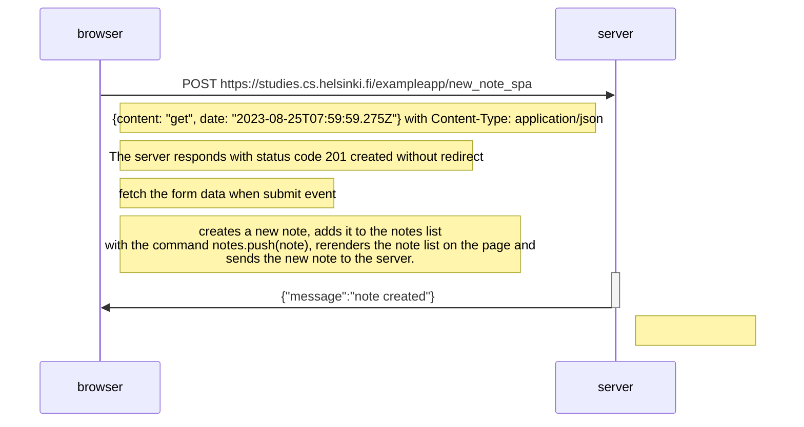

```mermaid
  sequenceDiagram
  participant browser
  participant server

  browser->>server: POST https://studies.cs.helsinki.fi/exampleapp/new_note_spa
  Note right of browser: {content: "get", date: "2023-08-25T07:59:59.275Z"} with Content-Type: application/json
  Note right of browser: The server responds with status code 201 created without redirect
  Note right of browser: fetch the form data when submit event
  Note right of browser: creates a new note, adds it to the notes list <br>  with the command notes.push(note), rerenders the note list on the page and <br> sends the new note to the server.
  activate server
  server->>browser: {"message":"note created"}
  deactivate server
  Note right of server: 
```
